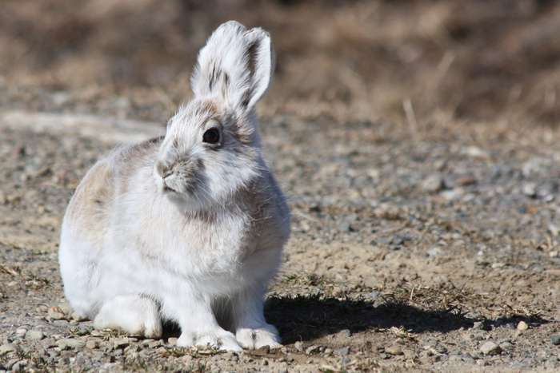
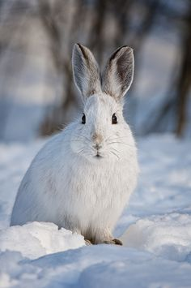

The following is a visualization of data collected on snowshoe hares (*Lepus americanus*) found in the Bonanza Creek Experimental Forest (Alaska) from 1999 to 2012. [Check out this database](https://doi.org/10.6073/pasta/03dce4856d79b91557d8e6ce2cbcdc14) for more information on the study.

### Wondering what a snowhoe hare looks like?

Here's an image of a snowshoe hare in the summer (Photo by Robb Hannawacker):



And here's an image of a snowshoe hare in the winter (Photo by Michael Cummings):



Because I don't know much about the methods of trapping showshoe hares or snowshoe hare behavior, the following is an exploration of the data to answer the question: What are the characteristics of individuals that were trapped frequently? For example, are females more likely to be trapped frequently? Are larger individuals less likely to evade trapping?

#### Let's find out!
```{r, message=FALSE, warning=FALSE}
#load packages
library(tidyverse)
library(lubridate)
library(ggbeeswarm)
library(kableExtra)
library(janitor)

#read in data
snowshoe <- read_csv("showshoe_lter.csv")

#tidy up data
hare_raw <- snowshoe %>%
  mutate(date=lubridate::mdy(date)) %>%  #convert to a date format R recognizes
  select(date,trap,grid,b_key,sex,weight,hindft,session_id,study) #remove variables with not a lot of data

#look at histograms of continuous data
hare_raw %>%
keep(is.numeric) %>% 
  gather() %>% 
  ggplot(aes(value)) +
    facet_wrap(~ key, scales = "free") +
    geom_histogram()
```

It might be interesting to look at weight across year for males and females at different locations.

#### Let's take a look at the data:
```{r,, message=FALSE}
unique(snowshoe$sex)
#definitely looks like there's some questioning of sex in here, let's remove those question marks

hare_wt <- hare_raw %>% 
  mutate(sex = str_to_lower(sex)) %>%  #convert all values to lowercase
  mutate(grid = str_to_lower(grid)) %>%  #do this again for lcation ("grid")
  filter(sex %in% c("m","f")) %>%  #remove all questionable values
  drop_na(weight) %>%  #remove rows without weight values
  select(date,grid,sex,weight,hindft) #only keep variables I actually want

ggplot(hare_wt, aes(x = date, y = weight)) +
  geom_jitter(size = 1, 
              alpha = 0.5,
              aes(color = sex,
                  pch = sex)) +
  facet_wrap(~grid) +
  scale_color_manual(values = c("pink","blue"))
```

Darn, it looks like only "bonrip" was continuously sampled from 2000-2015. So I'm going to focus on "bonrip" for my analysis.

#### Let's focus in on the main question: What are the characteristics of individuals that are trapped more than once?
```{r}
hare_trap <- hare_raw %>% 
  mutate(trap = str_to_lower(trap)) %>%  #convert all values to lowercase
  mutate(grid = str_to_lower(grid)) %>%  #do this again for location ("grid")
  mutate(sex = str_to_lower(sex)) %>% #do this again for sex
  filter(grid=="bonrip") #only look at individuals trapped in bonrip

#visualize number of times each individual was trapped
hare_counts <- hare_trap %>%
  count(b_key)

hist(hare_counts$n, breaks=20) #looks like a lot of individuals were trapped between 0-2 times

#isolate all individuals trapped more than twice
many <- plyr::ddply(hare_trap, "b_key", function(d) {if(nrow(d)>2) d else NULL}) %>%
  mutate(trapping="Trapped many times") #add so you can ID once you combine

# isolate all individuals trapped only once or twice (and make sure the math adds up)
few <- plyr::ddply(hare_trap, "b_key", function(d) {if(nrow(d)<=2) d else NULL}) %>%
  mutate(trapping="Trapped few times") #add so you can ID once you combine

#combine the two datasets
hare_trap <- rbind(many,few)
```

#### Now that we have the data all separated out, let's take a look at characteristics of individuals trapped many times versus few times:
```{r}
trapped <- hare_trap %>%
  mutate(bc = weight/hindft) %>% #calculate body condition values (from Flora 2002)
  drop_na(bc) %>%  #drop na values
  filter(sex %in% c("m","f")) #remove questionable sex values

ggplot(trapped, aes(x = sex, y=bc)) +
  geom_jitter(size = 1, 
              alpha = 0.5,
              aes(color = sex,
                  pch = sex)) +
  facet_wrap(~trapping)
```

Let's work a bit more with this.

#### Get summary statistics:
```{r}
trapped_summary <- trapped %>%
  group_by(trapping,sex) %>% #group by trapping status, then sex
  summarize(mean_bc = mean(bc), #get the mean body condition
            sd_bc = sd(bc), #get the s.d. body condition
            sample_size = n(), #get the sample size
            se_bc = sd(bc)/sqrt(n()), #get the s.e. body condition, in case it's useful
            var_bc = var(bc)) #get the variance body condition, in case it's useful

#put it all together in a nice looking table
kable(trapped_summary,
      col.names = c("Trapping frequency", "Sex", "Mean body condition", "Standard deviation", "Sample size", "Standard error", "Variance")) %>% 
  kable_styling(bootstrap_options = "striped",
                full_width = FALSE)
```

#### Now plot it up and make it pretty:
```{r}
ggplot() +
  geom_beeswarm(data=trapped,
                aes(x=sex, y=bc, color=sex),
                size=1,
                alpha=0.6) +
  geom_point(data=trapped_summary,
             aes(x=sex, y=mean_bc),
             color="black",
             fill="black",
             shape=23,
             size=2) +
  geom_errorbar(data=trapped_summary,
                aes(x=sex,
                    ymin=mean_bc - sd_bc,
                    ymax=mean_bc + sd_bc), 
                width=0.1) +
  xlab("Sex") +
  ylab("Body condition (g/mm)") +
  scale_x_discrete(labels=c("Female", "Male")) +
  facet_wrap(~trapping) +
  theme(legend.position="none",
        panel.background =  element_rect(fill = "white", colour = NA), 
        panel.border =      element_rect(fill = NA, colour="grey50"), 
        panel.grid.major =  element_line(colour = "grey90", size = 0.2),
        panel.grid.minor =  element_line(colour = "grey98", size = 0.5),
        axis.line = element_line(),
        strip.background = element_rect(colour = "black", fill = "white"),
        strip.text = element_text(size=12),
        axis.text=element_text(size=12),
        axis.title=element_text(size=14))
```

Figure 1. Body condition (g/mm) of snowshoe hares trapped few times (once or twice) or many times (more than twice), separated by sex. Black filled diamonds indicate mean values and error bars indicate standard deviation around the mean.

In the Bonanza Riparian zone, it appears that snowshoe hares trapped more frequently tended to have slightly higher body conditions than snowshoe hares trapped less frequently. Males and females did not have different body conditions, nor did they appear to be trapped more or less frequently.

#### Make a nice table showing percentages of each sex captured:
```{r, message=FALSE}
trapped_table <- trapped %>%
  group_by(trapping) %>% #group by trapping status
  count(sex) %>% #get counts for each sex
  pivot_wider(names_from=sex, values_from=n)

trapped_props <- trapped_table %>%
  adorn_percentages(denominator="row") %>% #convert to percentages
  adorn_pct_formatting(digits=1) %>% #dictate sig figs
  adorn_ns(position="front") #show counts follow by percentages

#put it all together in a nice looking table
kable(trapped_props,
      col.names = c("Trapping frequency","Female", "Male")) %>% 
  kable_styling(bootstrap_options = "striped",
                full_width = FALSE)
```

Table 1. Numbers and percentages of each sex of snowshoe hares trapped frequently ("many") or infrequently ("few").

In the Bonanza Riparian zone, female snowshoe hares were more likely to be trapped than male snowshoe hares. However, the percentages of each sex trapped did not change drastically between snowshoe hares trapped few or many times.