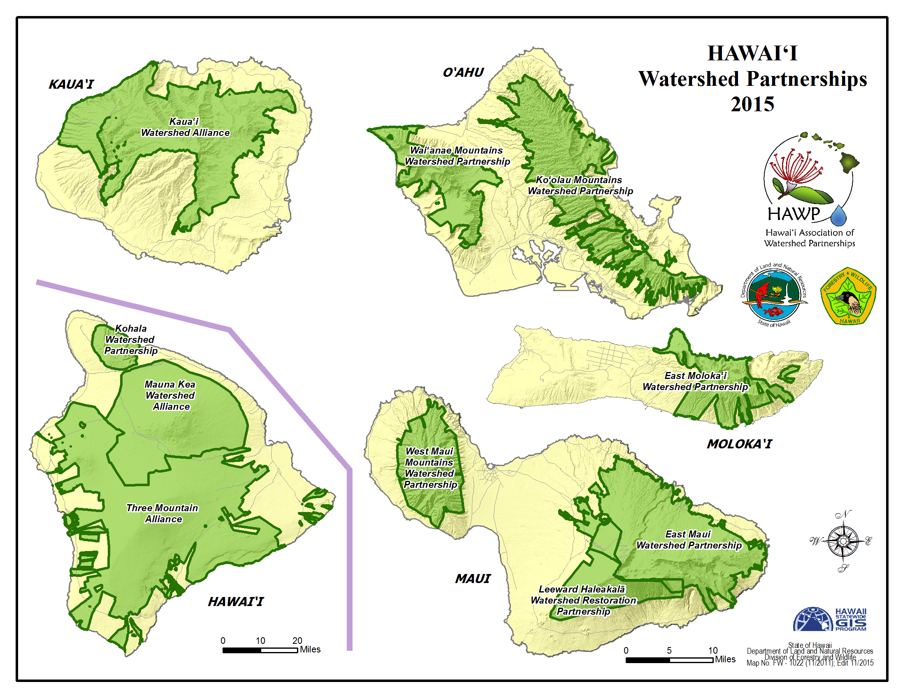

```{r setup, include=FALSE}
knitr::opts_chunk$set(echo = TRUE, message=FALSE, warning=FALSE)

#load packages
library(tidyverse)
library(tidyverse)
library(here)
library(janitor)
library(raster)
library(sf)
library(tmap)
#library(tmaptools)
library(gstat)

library(plotly)
library(paletteer)
library(ggspatial)
```

Here I will be mapping the watersheds for the main Hawaiian Islands, and zooming in on the main island of Hawaii. What is a watershed, you ask? [Here's a nice article](https://dlnr.hawaii.gov/ecosystems/wpp/learn/) to learn about the watersheds around the Hawaiian Islands.

Watershed Partnerships of the Hawaiian Islands
[(Source)](https://dlnr.hawaii.gov/ecosystems/wpp/partnerships/)


The data for this project was last updated in 2017. Curious where the data for this project comes from? [Look no further!](http://geoportal.hawaii.gov/datasets/watersheds)

### Let's get cracking!

Read in data:
```{r}
water <- read_sf(here("content", "post", "other-random-project", "Watersheds", "Watersheds.shp"))
```

Basically, plot it:
```{r}
plot(water)
```

Unfortunately, swma (water management area) doesn't look very interesting (i.e. diverse)...
"wuc" (watershed unit code text) and "huc" (watershed unit code numeric) also don't look too interesting. So let's plot hucarea (watershed area)!

Prepare map related things:
```{r}
st_crs(water) #cool, EPSG is 4326, as it should be

#Rename variable of interest in the name of good-looking maps
water <- water %>% 
  mutate(`Watershed Area (sq m)`= hucarea)
```

### Make a cool looking interactive map!
```{r}
water_map <- ggplot(data=water) +
  geom_sf(aes(fill=`Watershed Area (sq m)`), show.legend = FALSE, size=0.1) +
  scale_fill_paletteer_c("scico::hawaii", direction=-1) + #use Hawaii color scheme
  ggtitle("Watersheds of the Hawaiian Islands") +
  xlab("Longitude") +
  ylab("Latitude") +
  theme(panel.grid.major = element_line(color = "gray"(0.5), linetype = "dashed", size = 0.5),
        panel.background = element_rect(fill = "aliceblue"))

#make it interactive!
ggplotly(water_map) %>%
  highlight( "plotly_hover",
             selected = attrs_selected(line = list(color = "black")))
```

This super-cool interactive map allows us to zoom in to each of the islands and more clearly visualize the areas (in square meters) of each watershed on the Hawaiian Islands. 

As a proof of concept, let's zoom in on just the main island!
```{r}
library(scales)

ggplot(data=water) +
  geom_sf(aes(fill=`Watershed Area (sq m)`), size=0.1) +
  scale_fill_paletteer_c("scico::hawaii", direction=-1, label=comma) +
  coord_sf(xlim=c(-156.5, -154.5), ylim=c(18.7, 20.4)) + #zoom into big island
  annotation_scale(location = "br", width_hint = 0.3) + #add a scale bar
  annotation_north_arrow(location = "br", which_north = "true",
                         pad_x = unit(0.3,"in"), pad_y = unit(0.3, "in"),
                         style = north_arrow_fancy_orienteering) + #add compass
  ggtitle("Watersheds of Hawaii, HI") +
  xlab("Longitude") +
  ylab("Latitude") +
  theme(panel.grid.major = element_line(color = "gray"(0.5), linetype = "dashed", size = 0.5),
        panel.background = element_rect(fill = "aliceblue"))
```

This beautiful looking map shows us the delineations between each of the watersheds on Hawaii, as well as the area (in square meters) of each watershed (color-coded with a Hawaiian theme).