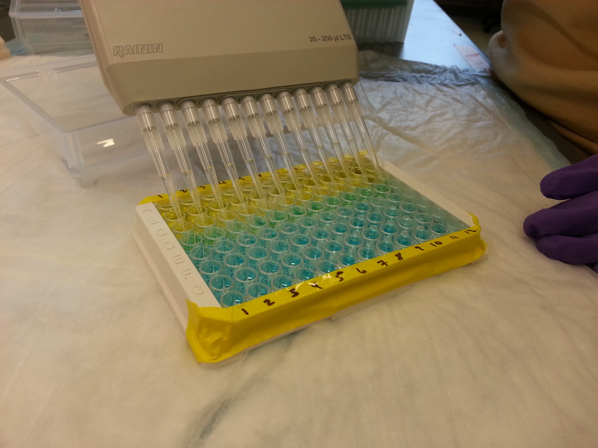

As an undergraduate at Dartmouth, I worked with Jessica Trout-Haney in the [Cottingham Lab](https://sites.dartmouth.edu/CottinghamLab/) on *Nostoc pruniforme* (known colloquially as the sea tomato), a benthic cyanobacteria found in ponds and lakes in Greenland. *Nostoc* can be incredibly dense in some lakes (over 9000/square meter) and likely contribute microcystins (a cyanotoxin) into aquatic ecosystems. Our study coupled observations and experiments to examine how *Nostoc* produce and release microcystins, and my focus was on how microcystin production varies throughout the colony. We found microcystins throughout the colony and observed undamaged colonies leaking microcystins into the surrounding water. Coupled with field observations of elevated microcystin concentrations around *Nostoc* colonies in Greenlandic lakes, these results provide strong evidence for *Nostoc pruniforme* as microcystin producers in Arctic freshwater ecosystems. Learn more about this research in the publication [here](www.ameliaritger.netlify.com).

